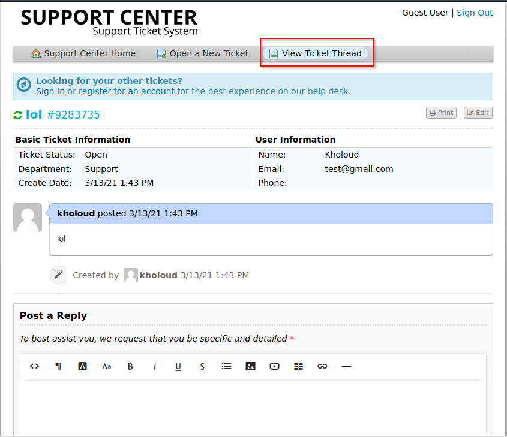

# Delivery

<h1 align="center">
   
  
   
</h1>
<h4 align="center">Machine IP: 10.10.10.222 </h4>

***

# Enumeration Phase

## NMAP

Use Nmap to know open ports & versions of each running service on ports if it's possible

If we're given ssh and an HTTP server as possible attack vectors, I prefer to start with HTTP because it has a greater chance than ssh and 
vulnerabilities in SSH aren't too common so let's start to enumerate HTTP: 

Going to http://10.10.10.222/ to see web page 

During Enumerating web page we will find we need to edit in our hosts file to be able to see HelpDesk and MatterMost server pages
which we find them in contact us page:

then openning a new ticket from support center page

Making use of the email which is created for us through opening ticket to register a new account in MatterMost:

then going to View Ticket Thread and refresh it we will find activation mail was sent and we will take the link of activation from it
and open it to verify our email in MatterMost and then log in and choose internal team after logging:
 

after logging we will find credentials:

***

# Exploitation Phase

Use credentials that we found to log in through ssh and find user flag:

***

# Privilege Escalation

