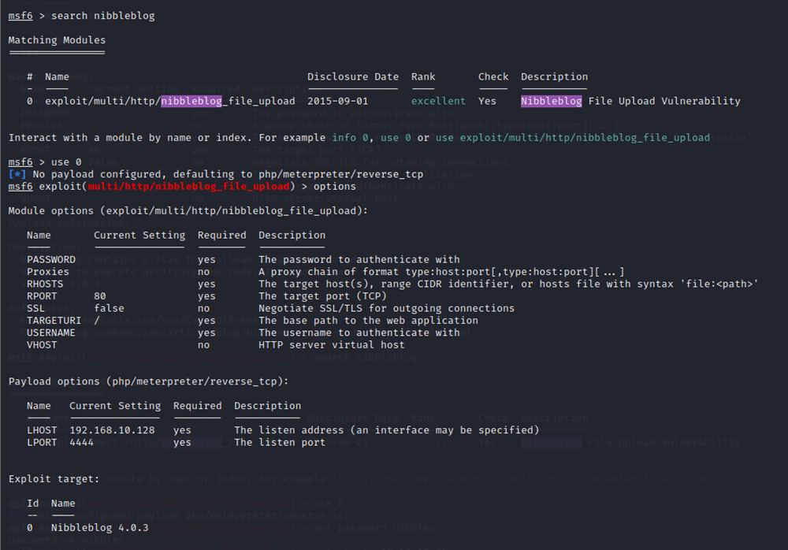
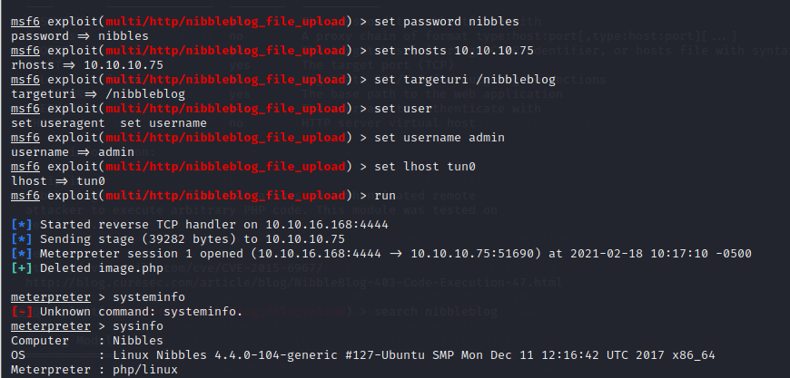
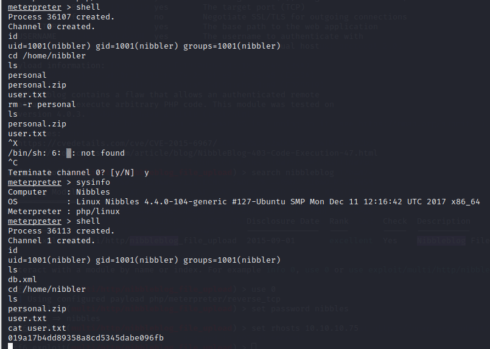

# Nibbles

<h1 align="center">
  <br>
  <a href="https://www.hackthebox.eu/home/machines/profile/121"></a>
  <br>
</h1>
<h4 align="center">Machine IP: 10.10.10.75 </h4>

***

# Enumeration Phase

## NMAP

Use Nmap to know open ports & versions of each running service on ports if it's possible


If we're given ssh and an HTTP server as possible attack vectors, I prefer to start with http because it has greater chance than ssh and 
vulnerabilities in SSH aren't too common so let's start enumerate http: 

Going to http://10.10.10.75/ to see web page which has only Hello World !


then we should see page source of it and we will find this:


So we will navigate to http://10.10.10.75/nibbleblog and find that:


Searching about nibbleblog we will find it an engine for creating blogs so we will try to find any exploit for it using metasploit 
and will find that:


Showing Info about this exploit so we will need to an authentication so we will try to find any authentication page in our enumeration,
so we will use gobuster to brute force directories and files names on web server.

```bash
gobuster dir -u http://10.10.10.75/nibbleblog -w /usr/share/wordlists/seclists/Discovery/Web-Content/common.txt -x php,md,html -t 50
```


In the nibbleblog/README we will find version of blog to be able to use appropriate exploit for it


Next let's take a look at nibbleblog/admin.php .As expected, we find a login page which we needed it so we will try to brute force
credentials using hydra, unfortunately I was blacklisted so we will try to guess it randomly as default credentials and it Succeeded.
use the the credentials admin:nibbles to login as admin.

***

# Exploitation Phase

We will continue using metasploit:



then set options and run to get a shell:



then we can find user flag:




***

# Privilege Escalation

run sudo -l command to to see if we have passwordless sudo access to anything because we didn't know password of nibbler:


so we will create a new monitor.sh file in the founded path then put in it command "bash -i" to return shell and execute it as sudo 
to get root shell as the following:


finally the root flag :"""""""""")


